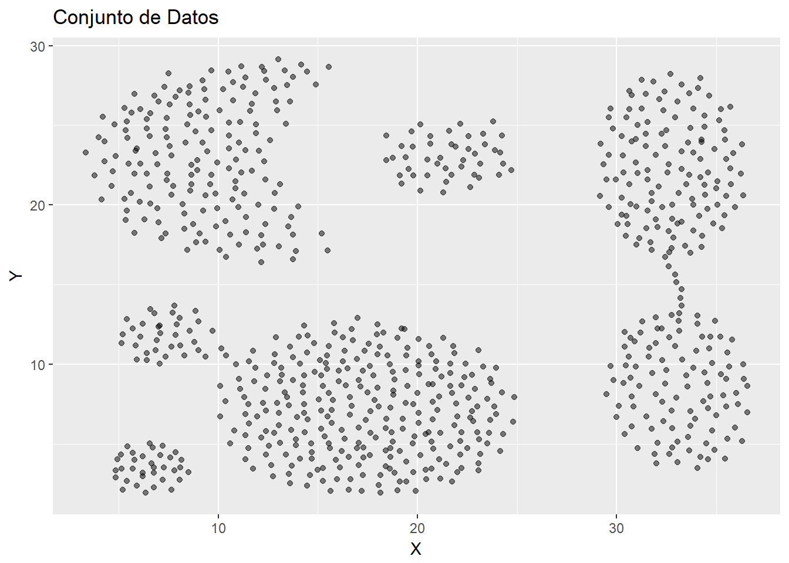
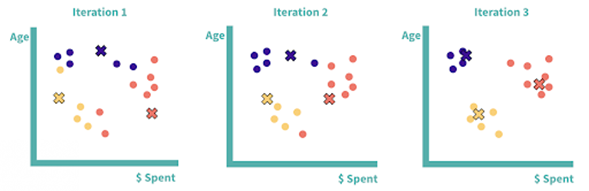

# OLC2_2SEVD25_ML_3

## Universidad de San Carlos de Guatemala, Diciembre 2025

## Facultad de Ingeniería

## Escuela de Ciencias y Sistemas

## Laboratorio Organización de Lenguajes y Compiladores 2 Sección A

| DATOS DE LOS INTEGRANTES                  |
| ----------------------------------------- |
| Carné:    202102140                       |
| Nombre:   Javier Andrés Monterroso García |
| Carné:    202103988                       |
| Nombre:   Raúl David Yoque Sum            |
| Carné:    202006633                       |
| Nombre:   Katherin Alejandra Gálvez Chiroy            |


<br>
<br>
<br>

<center>

# Manual Técnico

</center>

<br>


## Introducción a InsightCluster

En la actualidad, las empresas generan y almacenan grandes volúmenes de datos relacionados con el comportamiento de sus clientes, tales como registros de consumo y reseñas de productos. Sin embargo, estos datos suelen carecer de etiquetas o clasificaciones previas, lo que dificulta su análisis directo y la identificación de patrones relevantes que apoyen la toma de decisiones.

InsightCluster es un proyecto desarrollado como parte del curso **Organización de Lenguajes y Compiladores 2**, cuyo objetivo es diseñar e implementar una aplicación basada en técnicas de **aprendizaje no supervisado** para la segmentación de clientes y el agrupamiento de reseñas textuales. A través del uso de algoritmos de clustering, el sistema busca descubrir estructuras y patrones ocultos en los datos sin la necesidad de información previamente etiquetada.

El proyecto integra un flujo completo de análisis que abarca desde la carga y limpieza de los datos, pasando por su normalización y transformación, hasta el entrenamiento, evaluación e interpretación de los modelos de clustering. De esta manera, InsightCluster no solo se enfoca en la aplicación técnica de algoritmos de machine learning, sino también en la correcta interpretación de los resultados obtenidos, traduciendo la información técnica en conocimiento útil y comprensible.

Finalmente, InsightCluster pretende reforzar los conocimientos adquiridos en el curso, promoviendo buenas prácticas de programación, análisis de datos y documentación técnica, así como el desarrollo de soluciones que puedan ser aplicables a contextos reales del ámbito empresarial.

<br>

## Limpieza de datos

### Tipo correcto de los datos

```python
# Columnas numéricas para el análisis
cols_numericas = [
    'frecuencia_compra',
    'monto_total_gastado',
    'monto_promedio_compra',
    'dias_desde_ultima_compra',
    'antiguedad_cliente_meses',
    'numero_productos_distintos'
]

# Convertir columnas a numérico (errores → NaN)
for col in cols_numericas:
    df[col] = pd.to_numeric(df[col], errors='coerce')

# Convertir columnas a string
df['canal_principal'] = df['canal_principal'].astype("string")
df['texto_reseña'] = df['texto_reseña'].astype("string")
df['producto_categoria'] = df['producto_categoria'].astype("string")
```


En esta primera etapa del proceso de limpieza, consideramos fundamental asegurar que cada variable tenga el tipo de dato correcto, ya que un tipo incorrecto puede generar errores durante el análisis y afectar directamente el comportamiento de los algoritmos de clustering. Al trabajar con aprendizaje no supervisado, los modelos no corrigen este tipo de problemas por sí mismos, por lo que es responsabilidad nuestra preparar adecuadamente la información antes del entrenamiento.

Para el análisis de clientes, elaboramos un conjunto de columnas que representan variables numéricas, tales como la frecuencia de compra, los montos gastados y la antigüedad del cliente. Estas variables deben ser estrictamente numéricas, ya que posteriormente serán utilizadas en cálculos estadísticos, procesos de normalización y algoritmos como K-Means, los cuales requieren valores numéricos válidos para operar correctamente.

Al convertir estas columnas a tipo numérico, utilizamos un mecanismo que permite manejar errores de forma controlada. En lugar de provocar una interrupción del proceso cuando se encuentra un valor inválido —por ejemplo texto, símbolos o datos mal ingresados—, dichos valores se transforman automáticamente en valores nulos (NaN). Esta decisión es importante porque nos permite identificar y tratar posteriormente los datos problemáticos, ya sea mediante imputación o eliminación, sin comprometer la continuidad del flujo de limpieza.

Por otro lado, identificamos variables que representan información textual o categórica, como el canal principal de compra, el texto de la reseña y la categoría del producto. En estos casos, forzamos su conversión a tipo string para garantizar un manejo consistente del texto. Esta conversión resulta clave para aplicar operaciones de limpieza posteriores, como la normalización de mayúsculas y minúsculas, la eliminación de espacios innecesarios y el procesamiento del contenido textual de las reseñas.

<br>

### Eliminación de registros duplicados

```python
# Eliminación de duplicados por cliente_id y reseña_id
df = df.drop_duplicates(subset=[
    'cliente_id',
    'reseña_id'
])
```

En esta etapa consideramos importante eliminar registros duplicados presentes en el conjunto de datos, ya que la existencia de información repetida puede distorsionar los resultados del análisis y afectar la correcta formación de los clusters. En particular, elaboramos la limpieza tomando como referencia la combinación de las variables cliente_id y reseña_id, debido a que esta pareja identifica de forma única la relación entre un cliente y una reseña específica.

La presencia de duplicados en este contexto podría provocar que ciertos clientes o reseñas tengan mayor peso dentro del modelo, influyendo de manera incorrecta en las métricas de similitud y en la asignación de los grupos durante el proceso de clustering. Al eliminar estos duplicados, aseguramos que cada reseña asociada a un cliente sea considerada una sola vez, manteniendo la coherencia y representatividad de los datos.

Esta limpieza resulta especialmente relevante en un enfoque de aprendizaje no supervisado, donde el modelo no distingue entre información válida y redundante. Por ello, al depurar los registros duplicados desde esta etapa, contribuimos a que el análisis posterior se base en información más confiable, equilibrada y consistente, mejorando la calidad de los resultados obtenidos.

<br>

### Limpieza de variables

```python
# FRECUENCIA COMPRA

df.loc[df['frecuencia_compra'] < 0, 'frecuencia_compra'] = np.nan

q1 = df['frecuencia_compra'].quantile(0.25)
q3 = df['frecuencia_compra'].quantile(0.75)
iqr = q3 - q1

limite_superior = q3 + 1.5 * iqr

df.loc[df['frecuencia_compra'] > limite_superior, 'frecuencia_compra'] = np.nan
```


En esta etapa nos enfocamos en la limpieza de la variable frecuencia_compra, la cual representa la cantidad de compras realizadas por un cliente en un periodo determinado. Consideramos que esta variable es especialmente sensible, ya que valores incorrectos pueden alterar de forma significativa el comportamiento del modelo de clustering.

En primer lugar, elaboramos una validación básica para identificar valores negativos. Dado que no es lógico que un cliente tenga una frecuencia de compra menor a cero, decidimos marcar estos casos como valores nulos. Esta decisión nos permite reconocerlos posteriormente como datos inválidos y tratarlos de forma adecuada sin introducir información errónea al análisis.

Posteriormente, abordamos la presencia de valores atípicos utilizando el método del rango intercuartílico (IQR). Para ello, calculamos el primer y tercer cuartil de la variable y obtenemos el rango entre ambos. A partir de este valor, definimos un límite superior que nos permite identificar frecuencias de compra excesivamente altas en comparación con el comportamiento general de los clientes.

Cuando un valor supera este límite, lo consideramos atípico y lo convertimos en nulo. Esta limpieza es importante porque valores extremadamente grandes pueden dominar las distancias utilizadas por algoritmos como K-Means, provocando clusters poco representativos del conjunto de datos. Al controlar estos valores, buscamos que la variable refleje de manera más realista el patrón de compra típico de los clientes.

En conjunto, este proceso contribuye a que la información utilizada para el análisis sea más estable, coherente y adecuada para el entrenamiento de modelos de aprendizaje no supervisado, mejorando la calidad de los segmentos obtenidos.

En el caso de las variables monto_total_gastado, monto_promedio_compra, antiguedad_cliente_meses y numero_productos_distintos, aplicamos el mismo criterio de limpieza utilizado previamente para la variable frecuencia_compra. Consideramos que estas variables también representan magnitudes numéricas sensibles a valores inválidos y atípicos, por lo que fue necesario controlar tanto valores negativos como extremos antes del análisis.

De manera particular, elaboramos un umbral más flexible para las variables monto_total_gastado y antiguedad_cliente_meses, utilizando un límite superior de tres veces el rango intercuartílico. Esta decisión se tomó debido a que estas variables suelen presentar una mayor dispersión natural, ya sea por clientes con un historial largo de relación con la empresa o por consumidores con niveles de gasto acumulado significativamente más altos que el promedio.

<br>

### Limpieza de la variable dias_desde_ultima_compra

```python
df.loc[df['dias_desde_ultima_compra'] < 0, 'dias_desde_ultima_compra'] = np.nan

p95 = df["dias_desde_ultima_compra"].quantile(0.95)

df.loc[df["dias_desde_ultima_compra"] > p95, "dias_desde_ultima_compra"] = p95
```
En el caso de la variable dias_desde_ultima_compra, consideramos importante aplicar un tratamiento ligeramente distinto al de otras variables numéricas. Esta variable representa el tiempo que ha pasado desde la última compra de un cliente, por lo que es normal que existan valores altos, especialmente en clientes que llevan mucho tiempo sin interactuar con la empresa.

En primer lugar, eliminamos los valores negativos, ya que no es posible que hayan transcurrido días negativos desde una compra. Estos casos se consideran errores en los datos y se marcan como valores nulos para su posterior tratamiento.

Posteriormente, elaboramos un control de valores extremos utilizando el percentil 95. En lugar de eliminar por completo los valores muy altos, decidimos limitar su impacto estableciendo un tope máximo. Esto significa que cualquier valor que supere dicho percentil se reemplaza por el valor del percentil 95, manteniendo así la información general del comportamiento de los clientes sin permitir que unos pocos casos extremos dominen el análisis.

Este enfoque nos pareció más adecuado para esta variable, ya que permite conservar a los clientes con largos periodos de inactividad dentro del análisis, pero evitando que estos valores distorsionen las distancias utilizadas por el algoritmo de clustering. De esta forma, logramos un balance entre preservar información relevante y mantener la estabilidad del modelo en las etapas posteriores.


<br>

### Limpieza de la variable texto_reseña

```python
df['texto_reseña'] = (
    df['texto_reseña']
    .str.strip()
    .str.lower()
)

df = df[df['texto_reseña'].notna() & (df['texto_reseña'] != "")]
```

En la variable texto_reseña consideramos necesario normalizar el contenido antes de cualquier análisis. Elaboramos esta limpieza para eliminar espacios innecesarios y unificar el texto en minúsculas, evitando que diferencias de formato influyan en el procesamiento de las reseñas.

Además, decidimos eliminar los registros que no contienen texto válido, ya sea porque están vacíos o porque el valor es nulo. Esta depuración es importante porque una reseña sin contenido no aporta información útil y podría afectar negativamente los resultados del análisis textual y del proceso de clustering.

<br>

### Tratamiento de la variable cliente_id

```python
df = df[df['cliente_id'].notna()]
```
En el caso de la variable cliente_id, consideramos que su presencia es indispensable para el análisis, ya que identifica de forma única a cada cliente. Por esta razón, elaboramos una limpieza directa eliminando aquellos registros donde este valor no está presente.

Mantener registros sin identificador no aporta información útil y puede generar inconsistencias durante el análisis. Al eliminar estos casos, aseguramos que todos los datos utilizados correspondan a clientes válidos y correctamente identificados, fortaleciendo la calidad del conjunto de datos de entrada.

<br>

### Imputación de valores faltantes en variables numéricas

```python
mediana_frecuencia = df['frecuencia_compra'].median()
df['frecuencia_compra'] = df['frecuencia_compra'].fillna(mediana_frecuencia)
```

Después de limpiar valores inválidos y recortar outliers, consideramos que era importante resolver los valores faltantes porque, si dejamos NaN, muchas veces los algoritmos simplemente no pueden entrenar o terminan descartando filas completas. Eso significa que podríamos perder bastantes registros y, al final, el clustering se haría con menos información de la que realmente tenemos. Por eso elaboramos una imputación para “rellenar” esos huecos y mantener el dataset lo más completo posible, sin inventar valores raros ni meter ruido innecesario.

Elegimos la mediana porque, en la práctica, suele ser una opción más segura que el promedio cuando trabajamos con datos de compras, montos y comportamiento de clientes. El promedio se puede “desbalancear” fácilmente si existen unos pocos valores muy grandes o muy pequeños (aunque ya hayamos limpiado outliers, siempre pueden quedar casos extremos o distribuciones muy sesgadas). En cambio, la mediana es el valor que queda en el centro cuando ordenamos los datos, así que no se deja influenciar tanto por esos extremos. Dicho de forma simple, la mediana representa mejor a un “cliente típico” y no se va a ir hacia arriba solo porque existan algunos clientes que gastan muchísimo o compran demasiado.

Además, como el clustering funciona comparando distancias entre clientes, si imputáramos con un valor demasiado alto o demasiado bajo, podríamos terminar moviendo artificialmente a varios registros hacia clusters que no les corresponden. La mediana ayuda a que ese “relleno” sea más neutral y menos invasivo, o sea, que complete el dato sin alterar demasiado el patrón real del cliente.

Por esa misma razón, decidimos aplicar exactamente este criterio en las demás variables numéricas del dataset, como monto_total_gastado, monto_promedio_compra, dias_desde_ultima_compra, antiguedad_cliente_meses y numero_productos_distintos. Al imputarlas todas igual, mantenemos consistencia en el tratamiento del dataset y aseguramos que el modelo pueda trabajar con un conjunto estable, completo y más representativo, sin que los valores faltantes se conviertan en un problema durante el entrenamiento y la evaluación.


<br>
<br>
<br>
<br>

## K-Means
Para la segmentación de clientes con variables numéricas, consideramos que el enfoque más adecuado era utilizar K-Means, porque es un método de clustering que agrupa datos basándose en qué tan “parecidos” son entre sí, usando distancias. En pocas palabras, lo que hace K-Means es intentar formar grupos donde los clientes dentro de un mismo grupo se parezcan bastante, y al mismo tiempo estén lo más separados posible de los clientes de otros grupos. Esto nos sirve mucho en este proyecto porque justamente queremos descubrir patrones de comportamiento sin tener etiquetas previas, es decir, sin saber de antemano qué tipo de cliente es cada quien.



La idea detrás de K-Means es bastante directa. Primero, el algoritmo parte de un número de grupos que definimos nosotros (ese es el “K”). Luego, el método coloca unos puntos iniciales llamados centroides, que se pueden imaginar como el “centro” de cada grupo. Después, asigna cada cliente al centro que le quede más cercano, y vuelve a recalcular los centros con base en los clientes que quedaron asignados a cada grupo. Este proceso se repite varias veces hasta que los grupos dejan de cambiar de forma importante o hasta que se alcanza un límite de iteraciones. Lo bueno de esto es que al final obtenemos una segmentación clara: cada cliente queda en un grupo y ese grupo tiene un “perfil” numérico que se puede interpretar.



En nuestro caso, K-Means encaja bien porque las variables que estamos usando para clientes son numéricas y continuas, como montos, frecuencia de compra, días desde la última compra, antigüedad y cantidad de productos distintos. Este tipo de variables se presta muy bien para un algoritmo basado en distancias, porque son medidas que se pueden comparar directamente. Además, como el objetivo es crear segmentos como “clientes frecuentes”, “clientes de alto gasto”, “clientes inactivos”, etc., K-Means normalmente logra separar bien este tipo de patrones cuando los datos están bien preparados.

Y aquí entra un punto clave: la limpieza y la normalización son muy importantes para que K-Means funcione bien. Como este algoritmo toma decisiones con base en distancias, si dejamos valores extremos o escalas muy diferentes, el modelo se puede sesgar. Por ejemplo, una variable como monto_total_gastado podría dominar completamente la formación de grupos si no se controla, y entonces el clustering terminaría agrupando solo por “quién gasta más”, ignorando otras señales importantes como la frecuencia o la antigüedad. Por eso, primero limpiamos valores inválidos y controlamos outliers, y luego trabajamos con variables en una escala comparable. Esa preparación hace que K-Means sea más justo con todas las variables y la segmentación resulte más representativa.

#### Razones para la elección del modelo

* Una de las razones por la cual elegimos K-Means es porque se adapta de forma natural al análisis de variables numéricas, que es precisamente el tipo de información que estamos utilizando para segmentar a los clientes. Al basarse en distancias entre observaciones, este algoritmo aprovecha muy bien variables continuas como montos, frecuencias, antigüedad y tiempos, permitiendo identificar patrones reales de comportamiento sin necesidad de transformar excesivamente los datos. Esto nos facilita obtener grupos que reflejan similitudes reales entre clientes, en lugar de segmentaciones forzadas o artificiales.

* Además, K-Means permite una interpretación directa de los clusters, ya que cada grupo puede analizarse a partir de los valores centrales de sus variables. Esto resulta clave en el proyecto, porque no solo buscamos agrupar clientes, sino también entender qué caracteriza a cada segmento. Gracias a esta propiedad, es posible describir los clusters en términos claros de comportamiento, como niveles de gasto, frecuencia de compra o grado de actividad, lo cual facilita el análisis posterior y la toma de decisiones basada en los resultados del modelo.

* También consideramos importante que K-Means ofrece un control claro sobre sus parámetros principales, lo que nos permite ajustar el modelo de manera consciente y justificada. Podemos definir el número de clusters según las necesidades del análisis, limitar el número de iteraciones para garantizar convergencia y realizar múltiples inicializaciones para reducir el riesgo de obtener resultados poco representativos debido a una mala selección inicial de centroides. Este control nos brinda mayor estabilidad en los resultados y nos permite evaluar distintas configuraciones hasta encontrar una segmentación más coherente.

<br>
<br>
<br>
<br>


## Separación del proceso de clustering

Para el entrenamiento del modelo consideramos que no todas las variables debían tratarse de la misma forma. En el proyecto contamos con información de naturaleza distinta: por un lado, variables numéricas relacionadas con el comportamiento de compra de los clientes y, por otro lado, información textual proveniente de las reseñas. Debido a esta diferencia, decidimos dividir el proceso de clustering en dos partes independientes, utilizando un enfoque específico para cada tipo de dato.

En esta sección nos enfocamos únicamente en el **clustering de variables numéricas**, ya que estas representan cantidades medibles como montos, frecuencias y tiempos. Al separarlas del análisis textual, logramos un tratamiento más adecuado de los datos y evitamos mezclar técnicas que no son compatibles entre sí. Esto nos permite obtener segmentos de clientes más claros y coherentes basados exclusivamente en su comportamiento numérico.


### Explicación de código de Clustering numérico

```python
from sklearn.preprocessing import StandardScaler
from sklearn.cluster import KMeans
from sklearn.metrics import (
    silhouette_score,
    calinski_harabasz_score,
    davies_bouldin_score
)
```

Para llevar a cabo el proceso de clustering numérico, elaboramos la importación de varias herramientas de la librería scikit-learn, las cuales nos permiten preparar los datos, entrenar el modelo y evaluar la calidad de los resultados obtenidos.

En primer lugar, utilizamos StandardScaler, que se encarga de normalizar las variables numéricas. Consideramos este paso esencial porque K-Means trabaja con distancias, y si las variables no están en la misma escala, aquellas con valores más grandes pueden influir de manera desproporcionada en la formación de los clusters.

Posteriormente, importamos el algoritmo KMeans, el cual será el modelo principal encargado de realizar la segmentación de los clientes. Este algoritmo agrupa los datos en función de su similitud, permitiéndonos identificar patrones de comportamiento sin necesidad de etiquetas previas.

Finalmente, incorporamos métricas internas de validación como silhouette_score, calinski_harabasz_score y davies_bouldin_score. Estas métricas nos permiten evaluar qué tan bien se formaron los clusters, midiendo aspectos como la cohesión dentro de los grupos y la separación entre ellos. Gracias a estas métricas, podemos respaldar de forma objetiva la calidad del agrupamiento obtenido y justificar las decisiones tomadas durante el entrenamiento del modelo.


<br>

```python
# Columnas numéricas que usarás para clustering de clientes
cols_cluster_numerico = [
    'frecuencia_compra',
    'monto_total_gastado',
    'monto_promedio_compra',
    'dias_desde_ultima_compra',
    'antiguedad_cliente_meses',
    'numero_productos_distintos'
]

# Matriz numérica
X_num = df[cols_cluster_numerico].copy()

# Normalización (importante para K-Means)
scaler = StandardScaler()
X_num_scaled = scaler.fit_transform(X_num)
```

En esta parte del proceso definimos de forma explícita cuáles variables numéricas serían utilizadas para el clustering de clientes. Consideramos únicamente aquellas columnas que describen el comportamiento de compra y la relación del cliente con la empresa, como la frecuencia, los montos, el tiempo desde la última compra, la antigüedad y la variedad de productos adquiridos. Al seleccionar solo estas variables, nos aseguramos de que el modelo se enfoque en información relevante y comparable entre clientes.

Posteriormente, elaboramos una matriz numérica a partir del conjunto de datos limpio, copiando únicamente las columnas seleccionadas. Esta matriz representa la base sobre la cual se aplicará el algoritmo de clustering, separando claramente las variables numéricas del resto de la información que no participa directamente en este análisis.

Antes de entrenar el modelo, consideramos fundamental normalizar los datos utilizando StandardScaler. Este paso es clave porque K-Means calcula distancias entre los datos, y si las variables no están en la misma escala, aquellas con valores más grandes, como los montos monetarios, podrían dominar el proceso de agrupamiento. Al normalizar, logramos que todas las variables tengan una influencia similar dentro del modelo, permitiendo que el clustering refleje de mejor manera el comportamiento general de los clientes y no solo una característica en particular.


<br>

```python
kmeans_num = KMeans(
    n_clusters = k_num,
    max_iter = max_iter_num,
    random_state = 42,
    n_init = n_init_num
) 
```

En esta parte lo que hicimos fue crear (configurar) el modelo de K-Means con los parámetros que van a controlar cómo se forman los clusters. Consideramos importante definir estos hiperparámetros de forma explícita porque K-Means no es algo que se ejecute de manera arbitaria: dependiendo de cómo lo configuremos, el resultado puede variar. La idea es tener control sobre el comportamiento del algoritmo para poder probar, ajustar y justificar por qué una segmentación se ve mejor que otra.

* El parámetro **n_clusters = k_num** indica cuántos grupos queremos que el algoritmo forme. Aquí elegimos manejarlo como un hiperparámetro porque realmente no existe un “K perfecto” universal; depende del conjunto de datos y de qué tan detallada queramos la segmentación. Si K es muy pequeño, terminamos metiendo clientes diferentes en el mismo grupo y perdemos detalle. Si K es muy grande, el modelo puede crear grupos demasiado específicos y difíciles de interpretar. Por eso, consideramos que este es el hiperparámetro más importante para ajustar: nos permite buscar un balance entre segmentos útiles y segmentos interpretables, y luego validar esa elección con métricas internas.

* El parámetro **max_iter = max_iter_num** define el número máximo de iteraciones que K-Means puede realizar para ajustar los centroides. En palabras simples, es el “límite de intentos” que le damos al algoritmo para estabilizar los clusters. Lo manejamos como hiperparámetro porque si el límite es muy bajo, el modelo podría quedarse a medias y no terminar de acomodar bien los grupos. En cambio, si es demasiado alto, normalmente no mejora mucho, solo hace que el entrenamiento tarde más. Entonces, lo que buscamos aquí es darle suficiente espacio para converger sin hacerlo innecesariamente pesado.

* El parámetro **random_state = 42** lo usamos para mantener consistencia en los resultados. K-Means inicia con centroides aleatorios (o casi aleatorios), y eso puede hacer que en diferentes ejecuciones salgan clusters ligeramente distintos. Al fijar random_state, logramos reproducibilidad: si volvemos a correr el modelo con los mismos datos y parámetros, obtendremos el mismo resultado. Esto es clave para poder comparar experimentos, documentar métricas y defender que nuestros resultados no cambiaron “por suerte”.

* Por último, **n_init = n_init_num** define cuántas veces se reinicia el algoritmo con diferentes inicializaciones de centroides y se elige la mejor solución. Este hiperparámetro es importante porque K-Means puede caer en una solución mala si arranca con centroides poco favorables. Al permitir varios reinicios, reducimos ese riesgo y aumentamos la probabilidad de obtener clusters más estables y representativos. En resumen, n_init funciona como una forma práctica de mejorar la calidad del resultado sin cambiar los datos, solo dándole más oportunidades al algoritmo de “empezar bien”.

En conjunto, elegimos manipular estos hiperparámetros porque son los que más impactan la calidad y estabilidad del clustering. n_clusters nos permite ajustar el nivel de detalle de la segmentación, max_iter asegura que el algoritmo tenga oportunidad de converger correctamente, n_init ayuda a evitar soluciones pobres por inicialización, y random_state garantiza que podamos reproducir y justificar los resultados. Todo esto nos facilita defender técnicamente las decisiones del modelo y respaldarlas luego con las métricas internas de evaluación.

<br>

```python
clusters_num = kmeans_num.fit_predict(X_num_scaled)

df['cluster_clientes'] = clusters_num
```

En esta etapa ejecutamos finalmente el modelo de K-Means sobre los datos numéricos ya normalizados. Al utilizar el método fit_predict, el algoritmo primero entrena el modelo, ajustando los centroides a partir de los datos, y luego asigna a cada cliente el cluster al que pertenece. De esta forma, cada registro queda asociado directamente a un grupo específico según su similitud con los demás clientes.

El resultado de este proceso es un arreglo donde cada valor representa el identificador del cluster asignado a un cliente. Posteriormente, incorporamos esta información al DataFrame original creando la columna cluster_clientes. Consideramos importante guardar esta asignación porque nos permite relacionar fácilmente cada cliente con su segmento correspondiente y continuar con el análisis, la interpretación de los clusters y la generación de reportes. De esta manera, el clustering deja de ser solo un resultado del modelo y pasa a formar parte integral del conjunto de datos para las siguientes etapas del proyecto.

<br>

```python
sil_num = silhouette_score(X_num_scaled, clusters_num)
inercia_num = kmeans_num.inertia_
ch_num = calinski_harabasz_score(X_num_scaled, clusters_num)
db_num = davies_bouldin_score(X_num_scaled, clusters_num)
```

Una vez que el modelo de K-Means ha sido entrenado y que cada cliente ha sido asignado a un cluster, consideramos necesario evaluar la calidad del agrupamiento obtenido. Dado que estamos trabajando con aprendizaje no supervisado y no contamos con etiquetas reales, utilizamos métricas internas, las cuales analizan la estructura de los clusters basándose únicamente en los datos y en la forma en que estos fueron agrupados.


* La métrica de Silhouette nos permite medir qué tan bien encaja cada cliente dentro de su cluster en comparación con los demás clusters. En términos simples, nos indica si los clientes están bien agrupados con otros similares o si, por el contrario, podrían pertenecer mejor a otro grupo. Valores más altos indican clusters más definidos y mejor separados.

* La inercia es una métrica propia de K-Means y representa la suma de las distancias de los puntos a su centroide correspondiente. Esta métrica nos da una idea de qué tan compactos son los clusters: valores más bajos indican que los clientes están más cerca del centro de su grupo. Aunque por sí sola no define si un modelo es “bueno” o “malo”, resulta muy útil para comparar diferentes configuraciones del modelo, especialmente al variar el número de clusters.

* La métrica de Calinski-Harabasz evalúa la relación entre la dispersión interna de los clusters y la separación entre ellos. En otras palabras, mide qué tan bien diferenciados están los grupos formados. Valores más altos suelen indicar una mejor estructura de clustering, con clusters compactos y bien separados.

* Por último, el índice de Davies-Bouldin analiza qué tan similares son los clusters entre sí. A diferencia de las métricas anteriores, en este caso valores más bajos indican un mejor resultado, ya que reflejan clusters más distintos y con menor solapamiento entre ellos.

En conjunto, estas métricas nos permiten evaluar el clustering desde diferentes perspectivas y respaldar de manera objetiva la calidad del modelo entrenado. Gracias a ellas, podemos comparar distintas configuraciones de K-Means y justificar técnicamente las decisiones tomadas durante el proceso de segmentación de clientes.

<br>
<br>

### Explicación de código de Clustering para reseñas

#### Importación de librerías
En esta parte del proyecto comenzamos a trabajar con el clustering de texto, específicamente con las reseñas que los clientes dejan sobre los productos. La idea principal fue analizar estas opiniones sin etiquetas previas y tratar de agruparlas automáticamente según su contenido, para identificar patrones, temas recurrentes y tipos de comentarios similares entre los clientes.

Para esto, consideramos que primero era necesario transformar el texto en una representación numérica que pudiera ser entendida por un algoritmo de clustering. Analizamos distintas alternativas y creímos que la mejor decisión era utilizar sentence embeddings, ya que permiten capturar el significado general de una reseña completa y no solo la frecuencia de palabras individuales.

```python
from sentence_transformers import SentenceTransformer
```


Este módulo nos permitió utilizar un modelo de sentence embeddings que transforma cada reseña en un vector numérico, manteniendo la información semántica del texto. Consideramos que esta opción era adecuada porque las reseñas suelen ser frases cortas o párrafos breves, y este tipo de modelo funciona bien en ese contexto.

```python
from sklearn.preprocessing import normalize
```


Aunque el modelo de embeddings ya permite normalizar los vectores, incluimos esta importación para tener la opción de normalizar los datos en caso de ser necesario. La normalización es importante porque ayuda a que las distancias entre vectores sean comparables, especialmente cuando se trabaja con similitud coseno.

```python
from sklearn.cluster import MiniBatchKMeans
```

Para el proceso de clustering decidimos utilizar MiniBatchKMeans en lugar de KMeans tradicional. Consideramos esta decisión porque es un algoritmo más eficiente cuando se trabaja con grandes cantidades de datos y vectores de alta dimensión, como es el caso de los embeddings de texto. Aunque nuestro dataset no es extremadamente grande, creímos que era una buena práctica utilizar una versión más optimizada.

```python
from sklearn.metrics import silhouette_score, calinski_harabasz_score, davies_bouldin_score
```

Finalmente, importamos varias métricas internas de evaluación. Estas métricas nos permiten analizar qué tan bien se formaron los clusters, midiendo aspectos como la cohesión dentro de los grupos y la separación entre ellos. Consideramos importante incluir varias métricas y no solo una, para tener una visión más completa de la calidad del clustering realizado.

<br>

#### Preparación del corpus de texto

Antes de aplicar cualquier técnica de clustering, consideramos que era fundamental limpiar y preparar correctamente el texto de las reseñas. Analizamos el dataset y nos dimos cuenta de que podían existir valores nulos, espacios en blanco o reseñas vacías que no aportaban información útil al análisis.

```python
text_series = df["texto_reseña"].astype(str).fillna("").str.strip()
```

En esta línea convertimos todas las reseñas a tipo texto para evitar problemas de tipo de dato. Además, reemplazamos los valores nulos por cadenas vacías y eliminamos espacios innecesarios al inicio y al final de cada reseña. Creímos que esto era la mejor decisión para trabajar con un texto más limpio y consistente.

```python
text_series = text_series[text_series != ""]
```

Luego, filtramos las reseñas que quedaron completamente vacías. Consideramos que este tipo de registros no aportan valor al modelo, ya que no contienen información semántica que pueda ser utilizada para el agrupamiento.

```python
df_text = df.loc[text_series.index].copy()
```

En este paso creamos un subconjunto del dataframe original que solo incluye las filas correspondientes a las reseñas válidas. Analizamos que era importante mantener esta relación para luego poder asignar correctamente los clusters al dataset original.

```python
corpus = text_series.tolist()
```

Finalmente, convertimos la serie de reseñas en una lista de textos, la cual utilizamos como corpus de entrada para el modelo de embeddings. Consideramos que esta estructura era la más adecuada para alimentar el modelo de procesamiento de lenguaje natural en los siguientes pasos.

<br>

#### Generación de embeddings de texto

Una vez que ya teníamos el corpus de reseñas limpio, el siguiente paso fue transformar el texto en una forma que pudiera ser procesada por un algoritmo de clustering. Consideramos que los modelos de clustering trabajan con números, no con texto directamente, por lo que era necesario convertir cada reseña en un vector numérico.


Para lograr esto utilizamos sentence embeddings, que son representaciones vectoriales que capturan el significado general de una frase o un texto completo. A diferencia de otros enfoques más simples, como contar palabras, los embeddings permiten que reseñas con significados similares queden cercanas entre sí, incluso si no usan exactamente las mismas palabras. Analizamos esta opción y creímos que era la mejor decisión para trabajar con opiniones escritas por personas, donde el lenguaje suele variar bastante.

```python
model = SentenceTransformer("paraphrase-multilingual-MiniLM-L12-v2")
```

En esta línea cargamos un modelo de SentenceTransformer. Elegimos el modelo paraphrase-multilingual-MiniLM-L12-v2 porque es ligero, eficiente y además soporta múltiples idiomas, lo cual consideramos importante ya que las reseñas pueden no estar todas en el mismo idioma o pueden incluir expresiones mixtas. Este modelo está entrenado para generar embeddings que representan el significado de frases completas, lo cual se ajusta bien a nuestro caso de uso.

```python
emb = model.encode(
    corpus,
    batch_size=64,
    show_progress_bar=True,
    convert_to_numpy=True,
    normalize_embeddings=True
)
```

En este bloque utilizamos el modelo para generar los embeddings de todas las reseñas del corpus. Cada reseña se transforma en un vector numérico de alta dimensión que representa su contenido semántico.

El parámetro `batch_size=64` se utilizó para procesar las reseñas en grupos, lo que mejora el rendimiento y el uso de memoria. Decidimos trabajar de esta forma para hacer el proceso más eficiente, especialmente si el número de reseñas aumenta.

La opción `show_progress_bar=True` permite visualizar el avance del proceso, lo cual es útil para tener retroalimentación durante la ejecución.

Con `convert_to_numpy=True` convertimos los embeddings directamente en un arreglo de NumPy, facilitando su uso posterior con los algoritmos de clustering de scikit-learn.

Finalmente, `normalize_embeddings=True` normaliza los vectores generados, dejándolos listos para trabajar con similitud coseno. Consideramos esta normalización importante porque ayuda a que el clustering se base principalmente en la dirección de los vectores (es decir, el significado del texto) y no en su magnitud.

<br>

### ¿Cómo funcionan los sentence embeddings y qué representa el arreglo emb?

Luego de generar los embeddings, analizamos el contenido de la variable emb para entender exactamente qué información estamos produciendo y cómo se utiliza posteriormente en el clustering.

Al imprimir emb, obtenemos un arreglo como el siguiente:

```python
array([[ 1.3313390e-02,  4.3749455e-02, -4.7333110e-02, ...,
        -1.8189006e-05, -1.3221410e-02,  8.7186486e-02],
       [ 4.9896564e-02,  4.8884626e-02, -1.8012041e-02, ...,
        -5.0123066e-02,  4.4239413e-02,  4.1347556e-02],
       [ 2.6467448e-02, -5.1053952e-02,  2.8883517e-04, ...,
         4.5785517e-02,  4.9499784e-02, -1.5440427e-03],
       ...,
       [-5.1101249e-02,  5.9530366e-02, -2.5807638e-02, ...,
         5.3966165e-02,  3.1159002e-02,  7.4818149e-02],
       [-1.0184279e-02, -6.2871948e-02, -4.0177684e-02, ...,
         9.5936947e-02,  5.1693674e-02,  1.3113023e-02],
       [ 1.3313390e-02,  4.3749455e-02, -4.7333110e-02, ...,
        -1.8189006e-05, -1.3221410e-02,  8.7186486e-02]], dtype=float32)
```
Consideramos importante entender qué significa esta estructura antes de aplicar cualquier algoritmo de clustering.


**Vectorización del texto**

Cada fila del arreglo emb representa una reseña del corpus, y cada columna representa una dimensión del embedding. En otras palabras:

* 1 fila = 1 reseña
* Cada reseña se convierte en un vector numérico
* Cada vector captura el significado semántico del texto

El modelo transforma frases escritas por personas en vectores de números reales (valores positivos y negativos). Estos números no representan palabras específicas, sino características latentes aprendidas por el modelo, relacionadas con el significado del texto.

Por ejemplo, reseñas como:
* "El paquete se tardó en llegar"
* "La entrega fue muy lenta"

aunque usen palabras diferentes, generan vectores muy similares entre sí, porque el modelo entiende que el significado es prácticamente el mismo. Esto es justamente lo que buscamos para el clustering.

**Dimensionalidad del embedding**

Cada vector tiene muchas dimensiones. Consideramos que esta alta dimensionalidad es necesaria para capturar matices del lenguaje como:

* tono de la reseña,
* intención del cliente,
* queja, satisfacción o recomendación,
* similitud temática entre textos.

Aunque a simple vista los números del arreglo no parecen tener un significado interpretable por sí solos, el valor real está en las relaciones entre los vectores, no en cada número individual.


**Normalización y similitud coseno**

Al generar los embeddings utilizamos:

`
normalize_embeddings=True
`

Esto significa que cada vector queda normalizado, es decir, todos tienen la misma magnitud. Analizamos que esta decisión era importante porque el clustering se basa en qué tan similares son los textos entre sí, no en la magnitud del vector.

Gracias a esto, podemos utilizar similitud coseno, que mide el ángulo entre dos vectores:

* Ángulo pequeño - textos muy similares
* Ángulo grande - textos distintos

Este enfoque se adapta muy bien al análisis de lenguaje natural y fue una de las razones por las que creímos que este método era el más adecuado para agrupar reseñas.


<br>

### Justificación del uso de sentence embeddings

Al momento de decidir cómo representar las reseñas en forma numérica, analizamos distintas alternativas comunes en procesamiento de lenguaje natural, como TF-IDF, modelos basados en spaCy y otras técnicas tradicionales de vectorización. Sin embargo, después de evaluar las características del problema, creímos que el uso de sentence embeddings era la mejor decisión para este proyecto.

En primer lugar, TF-IDF se basa principalmente en la frecuencia de palabras dentro de los textos. Si bien es una técnica sencilla y ampliamente utilizada, consideramos que presenta una limitación importante en nuestro contexto: no captura el significado real de las frases. Dos reseñas pueden expresar la misma idea utilizando palabras diferentes y, aun así, TF-IDF las trataría como textos poco similares. Para un proyecto enfocado en opiniones de clientes, donde el lenguaje es muy variado, esta limitación puede afectar la calidad del clustering.

Por otro lado, analizamos el uso de modelos como spaCy, los cuales ofrecen vectores a nivel de palabra. Aunque estos modelos son útiles para tareas específicas, consideramos que no eran la mejor opción para nuestro caso, ya que las reseñas suelen ser frases completas o pequeños párrafos. Trabajar a nivel de palabras implicaría perder el contexto general de la reseña o requerir un procesamiento adicional para combinar los vectores, lo cual complicaría el flujo sin aportar un beneficio claro.

Los sentence embeddings permiten representar una reseña completa como un único vector que captura su significado global. Consideramos que esta característica es especialmente importante para nuestro proyecto, ya que buscamos agrupar reseñas por temas o intenciones similares (por ejemplo, quejas por envío, satisfacción con el producto o comentarios sobre precios), independientemente de las palabras exactas utilizadas.


<br>

### Clustering eficiente de reseñas (MiniBatchKMeans)
Ya con los embeddings listos (o sea, cada reseña convertida en su vector numérico), el siguiente paso fue agrupar esas reseñas en clusters. La idea aquí es que reseñas que “dicen lo mismo” o hablan de temas parecidos queden en el mismo grupo.

```python
kmeans = MiniBatchKMeans(
    n_clusters=k_text,
    random_state=42,
    batch_size=2048,
    max_iter=200,
    n_init="auto"
)
```
Aquí elegimos MiniBatchKMeans en lugar de KMeans tradicional por una razón bien práctica: los embeddings son vectores de alta dimensión (muchas columnas), y si el dataset crece, KMeans puede volverse más lento y pesado.

MiniBatchKMeans hace lo mismo que KMeans en esencia (agrupa por cercanía a centroides), pero en vez de usar todo el dataset en cada iteración, va entrenando por “pedacitos” (mini-batches).
Nos pareció mejor porque:

* Es más rápido 
* Consume menos memoria


**Hiperparámetros**

`n_clusters=k_text`, cuántos grupos queremos.

`random_state=42`,
esto lo usamos para que el resultado sea reproducible. Es decir, si volvemos a correr el notebook, no queremos que los clusters cambien solo porque sí. Consideramos que para documentación y evaluación, esto es importante.

`batch_size=2048`, este parámetro define cuántos puntos (reseñas) se usan por mini-lote. Elegimos 2048 porque es un número suficientemente grande como para que el modelo “vea” buena variedad en cada paso, pero sin llegar a ser tan grande que vuelva a ser casi como KMeans completo. En resumen: creímos que era un buen balance entre velocidad y estabilidad.

`max_iter=200`, esto define cuántas vueltas máximas puede dar el algoritmo tratando de ajustar los centroides. Elegimos 200 porque normalmente es suficiente para converger en este tipo de problema. Consideramos que subirlo demasiado no siempre mejora mucho, solo hace que tarde más.

`n_init="auto"`, esto controla cuántas veces se reinicia el algoritmo con centroides iniciales distintos para evitar quedar atrapado en una mala solución. Con "auto" dejamos que scikit-learn elija un valor adecuado según la versión, lo cual nos pareció práctico y seguro para no “hardcodear” un número que después podría no ser el mejor.


**Entrenamiento y asignación de clusters**

```python
labels = kmeans.fit_predict(emb)
```


Aquí el modelo se entrena con emb (los vectores) y al mismo tiempo nos devuelve labels, que es básicamente un arreglo donde cada reseña queda marcada con el número del cluster al que pertenece (0, 1, 2, …, 5 si K=6).
Lo que hace el algoritmo por dentro es:

* coloca centroides iniciales,
* asigna cada reseña al centroide más cercano,
* recalcula los centroides,
* repite hasta estabilizar.

```python
df_text["cluster_reseñas"] = labels
```

<br>
<br>
<br>
<br>
<br>
<br>

# InsightCluster Frontend

## Tabla de Contenidos
1. [Información General](#información-general)
2. [Arquitectura del Sistema](#arquitectura-del-sistema)
3. [Tecnologías y Herramientas](#tecnologías-y-herramientas)
4. [Estructura del Proyecto](#estructura-del-proyecto)
5. [Componentes Principales](#componentes-principales)
6. [Flujo de Datos](#flujo-de-datos)
7. [API y Comunicación con Backend](#api-y-comunicación-con-backend)
8. [Gestión de Estado](#gestión-de-estado)
9. [Estilos y UI/UX](#estilos-y-uiux)
10. [Instalación y Configuración](#instalación-y-configuración)
11. [Despliegue](#despliegue)
12. [Mantenimiento y Mejoras](#mantenimiento-y-mejoras)

---

## Información General

**Nombre del Proyecto:** InsightCluster  
**Versión:** 1.0.0  
**Descripción:** Aplicación web para segmentación de clientes y análisis de reseñas mediante clustering de machine learning.

**Propósito:** Proporcionar una interfaz intuitiva para que usuarios no técnicos puedan:
- Cargar datasets en formato CSV
- Configurar algoritmos de clustering (K-Means)
- Visualizar resultados de segmentación
- Evaluar métricas de calidad del clustering
- Exportar resultados procesados

---

## Arquitectura del Sistema

### Patrón de Diseño
La aplicación sigue una arquitectura **Component-Based** utilizando React con hooks funcionales.

```
┌─────────────────────────────────────────┐
│          App.jsx (Root)                 │
│  - Gestión de navegación por tabs       │
│  - Estado global de configuración       │
│  - Manejo de mensajes globales          │
└─────────────┬───────────────────────────┘
              │
    ┌─────────┴──────────┐
    │                    │
┌───▼────────┐  ┌────────▼────────┐
│  Sidebar   │  │   Main Content  │
│ Navigation │  │   Area          │
└────────────┘  └────────┬────────┘
                         │
        ┌────────────────┼────────────────┐
        │                │                │
┌───────▼──────┐ ┌──────▼──────┐ ┌──────▼──────┐
│ Upload &     │ │   Train     │ │  Results &  │
│ Preprocess   │ │  Section    │ │   Export    │
└──────────────┘ └─────────────┘ └─────────────┘
        │                │                │
        └────────────────┼────────────────┘
                         │
                    ┌────▼────┐
                    │  API    │
                    │ (api.js)│
                    └─────────┘
                         │
                    ┌────▼────┐
                    │ Backend │
                    │  REST   │
                    │   API   │
                    └─────────┘
```

---

## Tecnologías y Herramientas

### Framework y Librerías Core

| Tecnología | Versión | Propósito |
|------------|---------|-----------|
| **React** | 18.3+ | Framework principal para construcción de UI |
| **Vite** | 5.4+ | Build tool y dev server de alto rendimiento |
| **JavaScript (ES6+)** | - | Lenguaje de programación |

### Dependencias de Desarrollo

```json
{
  "vite": "^5.4.10",
  "@vitejs/plugin-react": "^4.3.3",
  "eslint": "^9.13.0",
  "eslint-plugin-react": "^7.37.2",
  "eslint-plugin-react-hooks": "^5.0.0",
  "eslint-plugin-react-refresh": "^0.4.14"
}
```

### Herramientas de Desarrollo

- **ESLint**: Linting y análisis estático de código
- **Vite HMR**: Hot Module Replacement para desarrollo
- **React DevTools**: Depuración de componentes React

### Gestión de Paquetes
- **npm** o **yarn**: Gestión de dependencias

---

## Estructura del Proyecto

```
frontend/
├── node_modules/           # Dependencias instaladas
├── public/                 # Archivos estáticos públicos
├── src/
│   ├── assets/            # Recursos (imágenes, iconos)
│   │   └── react.svg
│   ├── api.js             # ⭐ Capa de comunicación con backend
│   ├── App.css            # Estilos globales CSS
│   ├── App.jsx            # ⭐ Componente principal
│   ├── index.css          # Estilos base de la aplicación
│   └── main.jsx           # ⭐ Punto de entrada de React
├── .gitignore             # Archivos ignorados por Git
├── eslint.config.js       # Configuración de ESLint
├── index.html             # Template HTML principal
├── package-lock.json      # Lock de versiones de dependencias
├── package.json           # ⭐ Configuración del proyecto
├── README.md              # Documentación del usuario
└── vite.config.js         # ⭐ Configuración de Vite
```

### Archivos Clave

#### `package.json`
Define scripts, dependencias y metadatos del proyecto:
```json
{
  "scripts": {
    "dev": "vite",              // Servidor de desarrollo
    "build": "vite build",      // Build de producción
    "preview": "vite preview",  // Preview del build
    "lint": "eslint ."          // Análisis de código
  }
}
```

#### `vite.config.js`
Configuración del bundler:
```javascript
import { defineConfig } from 'vite'
import react from '@vitejs/plugin-react'

export default defineConfig({
  plugins: [react()],
  server: {
    port: 3000,        // Puerto de desarrollo
    proxy: {           // Proxy para evitar CORS
      '/api': {
        target: 'http://localhost:5000',
        changeOrigin: true
      }
    }
  }
})
```

#### `main.jsx`
Punto de entrada que monta la aplicación React:
```javascript
import React from 'react'
import ReactDOM from 'react-dom/client'
import App from './App.jsx'
import './index.css'

ReactDOM.createRoot(document.getElementById('root')).render(
  <React.StrictMode>
    <App />
  </React.StrictMode>,
)
```

---

## Componentes Principales

### 1. App Component (`App.jsx`)

**Responsabilidades:**
- Gestión de navegación entre secciones (tabs)
- Manejo de estado global de configuración
- Propagación de mensajes y errores
- Renderizado del layout principal

**Estado Principal:**
```javascript
const [activeTab, setActiveTab] = useState("upload");
const [globalMessage, setGlobalMessage] = useState("");
const [globalError, setGlobalError] = useState("");
const [cfg, setCfg] = useState({
  k_clientes: 6,      // Número de clusters para clientes
  max_iter: 300,      // Iteraciones máximas K-Means
  n_init: 10,         // Número de reinicios K-Means
  k_reseñas: 5,       // Número de clusters para reseñas
});
```

**Flujo de Navegación:**
```
Upload → Train → Results → Eval & Export
```

### 2. UI Components Helper

#### `AlertBox`
**Propósito:** Mostrar mensajes de éxito o error globales.

**Props:**
- `kind`: "success" | "error"
- `children`: Contenido del mensaje

**Estilos Dinámicos:**
```javascript
backgroundColor: isError ? "#450a0a" : "#022c22"
border: isError ? "#b91c1c" : "#047857"
```

#### `NavButton`
**Propósito:** Botón de navegación en el sidebar.

**Props:**
- `active`: Boolean que indica si está activo
- `onClick`: Handler de click
- `children`: Texto del botón

**Características:**
- Efecto de scale al hacer click (`transform: scale(0.99)`)
- Cambio de color según estado activo
- Transiciones suaves (120ms)

#### `Card`
**Propósito:** Contenedor visual para agrupar contenido relacionado.

**Props:**
- `title`: Título de la tarjeta
- `description`: Descripción opcional
- `children`: Contenido de la tarjeta
- `style`: Estilos adicionales

#### Botones Especializados

| Componente | Uso | Color |
|------------|-----|-------|
| `PrimaryButton` | Acciones principales | Azul (#1d4ed8) |
| `SuccessButton` | Confirmaciones | Verde (#10b981) |
| `GhostButton` | Acciones secundarias | Gris (#334155) |

#### `Badge`
**Propósito:** Etiquetas visuales para categorización.

**Props:**
- `text`: Texto a mostrar
- `color`: Color del badge (default: #93c5fd)

### 3. Secciones Funcionales

#### `UploadAndPreprocessSection`

**Responsabilidad:** Carga de archivos CSV y preprocesamiento de datos.

**Estado Local:**
```javascript
const [file, setFile] = useState(null);
const [uploadId, setUploadId] = useState(null);  // ID único del upload
const [loadingUpload, setLoadingUpload] = useState(false);
const [loadingPre, setLoadingPre] = useState(false);
```

**Flujo de Operación:**
```
1. Usuario selecciona archivo CSV
2. handleUpload() → uploadCsv(file)
3. Backend retorna upload_id
4. handlePreprocess() → preprocessData({ upload_id })
5. Datos listos para clustering
```

**Validaciones:**
- Verificar que se haya seleccionado archivo
- Verificar que exista upload_id antes de preprocesar
- Manejo de estados de carga

#### `TrainSection`

**Responsabilidad:** Configuración y entrenamiento de modelos de clustering.

**Props Recibidas:**
```javascript
{ 
  setGlobalMessage, 
  setGlobalError, 
  cfg,      // Configuración actual
  setCfg    // Setter de configuración
}
```

**Componentes UI Internos:**

**`SliderRow`:**
```javascript
<SliderRow
  label="Número de Clusters (K)"
  value={cfg.k_clientes}
  min={2}
  max={100}
  step={1}
  onChange={(v) => update("k_clientes", v)}
/>
```

**Estado Local:**
```javascript
const [loadingSave, setLoadingSave] = useState(false);
const [trainResponse, setTrainResponse] = useState(null);
```

**Parámetros de Clustering:**
- **k_clientes**: Número de segmentos de clientes (2-100)
- **max_iter**: Iteraciones máximas del algoritmo (100-500)
- **n_init**: Reinicios aleatorios para encontrar mejor centroide (5-30)
- **k_reseñas**: Número de clusters para análisis de texto (fijo: 5)

#### `ResultsSection`

**Responsabilidad:** Visualización de métricas de evaluación del clustering.

**Estructura de Datos:**
```javascript
const evaluationData = {
  title: "Evaluación y validación del análisis",
  metrics: [
    {
      name: "Inercia",
      value: "85.63",
      description: "Suma de distancias cuadradas..."
    },
    // ... más métricas
  ]
}
```

**Métricas Visualizadas:**

| Métrica | Rango | Interpretación |
|---------|-------|----------------|
| **Inercia** | 0-∞ | Menor es mejor (compactación) |
| **Calinski-Harabasz** | 0-∞ | Mayor es mejor (separación) |
| **Coeficiente de Silueta** | -1 a 1 | >0.7 excelente, <0.3 pobre |
| **Davies-Bouldin** | 0-∞ | Menor es mejor (similitud clusters) |

**Funciones de Evaluación:**

```javascript
// Calcula progreso visual (0-100%)
calculateProgress(metricName, value)

// Retorna color según calidad
getMetricColor(metricName, value)
// Verde: excelente, Amarillo: aceptable, Rojo: pobre

// Genera interpretación textual
getMetricInterpretation(metricName, value)

// Califica la métrica
getMetricQuality(metricName, value)
// "Excelente" | "Bueno" | "Regular" | "Deficiente"
```

**Características UI:**
- Grid responsivo (4 columnas → 2 → 1 en móvil)
- Barras de progreso visuales
- Código de colores por calidad
- Recomendaciones automáticas
- Scroll personalizado

#### `EvalExportSection`

**Responsabilidad:** Métricas detalladas y exportación de resultados.

**Estado Local:**
```javascript
const [metrics, setMetrics] = useState(null);
const [loadingMetrics, setLoadingMetrics] = useState(false);
const [loadingExport, setLoadingExport] = useState({
  clients: false,
  reviews: false,
  summary: false,
});
```

**Funciones de Exportación:**
```javascript
// Exporta clientes segmentados (CSV)
exportClients()

// Exporta reseñas clasificadas (CSV)
exportReviews()

// Exporta resumen ejecutivo (JSON)
exportSummary()
```

**Ciclo de Vida:**
```javascript
useEffect(() => {
  load();  // Carga automática de métricas al montar
}, []);
```

---

## Flujo de Datos

### Arquitectura de Comunicación

```
┌─────────────┐
│   Usuario   │
└──────┬──────┘
       │ Interacción
┌──────▼──────────────────────────┐
│     Componente React            │
│  (UI + Estado Local)            │
└──────┬──────────────────────────┘
       │ Llamada a función
┌──────▼──────────────────────────┐
│       api.js                    │
│  (Abstracción HTTP)             │
└──────┬──────────────────────────┘
       │ fetch() + credentials
┌──────▼──────────────────────────┐
│    Backend REST API             │
│  (Python Flask/FastAPI)         │
└──────┬──────────────────────────┘
       │ Respuesta JSON
┌──────▼──────────────────────────┐
│   Componente React              │
│  (Actualiza estado)             │
└──────┬──────────────────────────┘
       │ Re-render
┌──────▼──────────────────────────┐
│        UI Actualizada           │
└─────────────────────────────────┘
```

### Gestión de Errores

Patrón estándar en todos los componentes:

```javascript
const handleAction = async () => {
  setGlobalError("");
  setGlobalMessage("");
  
  try {
    setLoading(true);
    const result = await apiFunction(params);
    setGlobalMessage(result.message || "Operación exitosa");
  } catch (err) {
    setGlobalError(err.message);
  } finally {
    setLoading(false);
  }
};
```

**Niveles de Error:**
1. **Validación Local**: Antes de llamar API
2. **Error de Red**: Capturado en catch
3. **Error de Backend**: Propagado desde api.js
4. **Mensaje Global**: Mostrado en AlertBox

---

## API y Comunicación con Backend

### Estructura del Módulo `api.js`

```javascript
// Base URL del backend
const BASE_URL = "http://localhost:5000/api";

// Configuración de fetch con credenciales
const fetchConfig = {
  credentials: "include",  // Incluye cookies de sesión
  headers: {
    "Content-Type": "application/json"
  }
};
```

### Endpoints Disponibles

#### 1. Upload CSV
```javascript
export async function uploadCsv(file) {
  const formData = new FormData();
  formData.append("file", file);
  
  const response = await fetch(`${BASE_URL}/upload`, {
    method: "POST",
    body: formData,
    credentials: "include"
  });
  
  return await response.json();
  // Retorna: { upload_id: string, message: string }
}
```

#### 2. Preprocess Data
```javascript
export async function preprocessData(payload) {
  // payload = { upload_id: string }
  const response = await fetch(`${BASE_URL}/preprocess`, {
    method: "POST",
    headers: { "Content-Type": "application/json" },
    body: JSON.stringify(payload),
    credentials: "include"
  });
  
  return await response.json();
  // Retorna: { message: string, stats: object }
}
```

#### 3. Train Clusters
```javascript
export async function trainClusters(cfg) {
  // cfg = { k_clientes, max_iter, n_init, k_reseñas }
  const response = await fetch(`${BASE_URL}/train`, {
    method: "POST",
    headers: { "Content-Type": "application/json" },
    body: JSON.stringify(cfg),
    credentials: "include"
  });
  
  return await response.json();
  // Retorna: { message: string, clusters_info: object }
}
```

#### 4. Get Metrics
```javascript
export async function getMetrics() {
  const response = await fetch(`${BASE_URL}/metrics`, {
    credentials: "include"
  });
  
  return await response.json();
  /*
  Retorna: {
    silhouette_clientes: float,
    calinski_clientes: float,
    davies_clientes: float,
    silhouette_reseñas: float,
    calinski_reseñas: float,
    davies_reseñas: float
  }
  */
}
```

#### 5. Export Functions

**Exportar Clientes:**
```javascript
export async function exportClients() {
  const response = await fetch(`${BASE_URL}/export/clients`, {
    credentials: "include"
  });
  
  const blob = await response.blob();
  downloadFile(blob, "clientes_segmentados.csv");
}
```

**Exportar Reseñas:**
```javascript
export async function exportReviews() {
  const response = await fetch(`${BASE_URL}/export/reviews`, {
    credentials: "include"
  });
  
  const blob = await response.blob();
  downloadFile(blob, "reseñas_clasificadas.csv");
}
```

**Exportar Resumen:**
```javascript
export async function exportSummary() {
  const response = await fetch(`${BASE_URL}/export/summary`, {
    credentials: "include"
  });
  
  const blob = await response.blob();
  downloadFile(blob, "resumen_clustering.json");
}
```

#### Helper: Download File
```javascript
function downloadFile(blob, filename) {
  const url = window.URL.createObjectURL(blob);
  const a = document.createElement("a");
  a.href = url;
  a.download = filename;
  document.body.appendChild(a);
  a.click();
  a.remove();
  window.URL.revokeObjectURL(url);
}
```

### Manejo de Sesiones

**Cookies HTTP-Only:**
- El backend debe configurar cookies de sesión
- Frontend incluye `credentials: "include"` en todas las peticiones
- Permite mantener contexto del usuario sin tokens en localStorage

**CORS Configuration Required:**
```python
# Backend (Flask ejemplo)
CORS(app, 
     supports_credentials=True,
     origins=["http://localhost:3000"])
```

---

## Gestión de Estado

### Estados Globales (App Level)

```javascript
// Navegación
const [activeTab, setActiveTab] = useState("upload");

// Mensajes y Errores
const [globalMessage, setGlobalMessage] = useState("");
const [globalError, setGlobalError] = useState("");

// Configuración Persistente
const [cfg, setCfg] = useState({
  k_clientes: 6,
  max_iter: 300,
  n_init: 10,
  k_reseñas: 5,
});
```

### Estados Locales por Sección

**Upload Section:**
```javascript
- file: File | null
- uploadId: string | null
- loadingUpload: boolean
- loadingPre: boolean
```

**Train Section:**
```javascript
- loadingSave: boolean
- trainResponse: object | null
```

**Results Section:**
```javascript
- loading: boolean
- useMockData: boolean (no utilizado actualmente)
```

**Eval Section:**
```javascript
- metrics: object | null
- loadingMetrics: boolean
- loadingExport: {clients, reviews, summary}
```

### Propagación de Estado

**Pattern: Props Drilling**
```javascript
<TrainSection
  setGlobalMessage={setGlobalMessage}  // Callback para mensajes
  setGlobalError={setGlobalError}      // Callback para errores
  cfg={cfg}                            // Estado compartido
  setCfg={setCfg}                      // Setter compartido
/>
```

**Alternativa Futura:** Context API o Zustand para evitar prop drilling en aplicaciones más grandes.

---

## Estilos y UI/UX

### Sistema de Diseño

**Paleta de Colores:**

| Uso | Color Hex | Descripción |
|-----|-----------|-------------|
| Background Principal | `#0f172a` | Azul oscuro slate |
| Background Secundario | `#020617` | Negro azulado |
| Bordes | `#1e293b` | Gris azulado |
| Texto Principal | `#e5e7eb` | Gris claro |
| Texto Secundario | `#9ca3af` | Gris medio |
| Primario (Botones) | `#1d4ed8` | Azul |
| Éxito | `#10b981` | Verde esmeralda |
| Error | `#ef4444` | Rojo |
| Advertencia | `#f59e0b` | Ámbar |

**Tipografía:**
```css
font-family: "system-ui, sans-serif"
```

**Tamaños:**
- Título Principal: 20px
- Título Sección: 18px
- Subtítulo: 16px
- Texto Normal: 14px
- Texto Pequeño: 13px
- Auxiliar: 12px

### Responsive Design

**Breakpoints:**
```css
@media (max-width: 900px) {
  /* 2 columnas → 1 columna */
  grid-template-columns: 1fr !important;
}

@media (max-width: 1200px) {
  /* 4 columnas → 2 columnas */
  grid-template-columns: repeat(2, 1fr) !important;
}
```

**Estrategia:**
- Mobile First approach
- Grid layouts auto-adaptables
- Sidebar colapsable en móvil (futuro)

### Animaciones y Transiciones

**Botones:**
```css
transition: transform 120ms ease, background-color 120ms ease;
transform: scale(0.99);  /* Al hacer click */
```

**Hover Effects:**
```css
cursor: pointer;
opacity: 0.7;  /* Cuando disabled */
```

### Accesibilidad

**Consideraciones:**
- Contraste de colores cumple WCAG AA
- Estados de `disabled` visualmente claros
- Feedback visual en acciones (loading states)
- Mensajes de error descriptivos

**Mejoras Pendientes:**
- ARIA labels
- Navegación por teclado
- Screen reader support
- Focus indicators más prominentes

---

## Instalación y Configuración

### Requisitos Previos

- **Node.js**: >= 18.0.0
- **npm**: >= 9.0.0 (o yarn >= 1.22.0)
- **Backend**: Servidor API corriendo en puerto 5000

### Instalación

```bash
# 1. Clonar repositorio
git clone <repository-url>
cd frontend

# 2. Instalar dependencias
npm install
# o
yarn install

# 3. Verificar instalación
npm list react react-dom vite
```

### Configuración de Entorno

Crear archivo `.env` (opcional):
```env
VITE_API_BASE_URL=http://localhost:5000/api
VITE_APP_NAME=InsightCluster
```

Modificar `vite.config.js` si es necesario:
```javascript
export default defineConfig({
  plugins: [react()],
  server: {
    port: 3000,
    proxy: {
      '/api': {
        target: process.env.VITE_API_BASE_URL || 'http://localhost:5000',
        changeOrigin: true,
        secure: false,
      }
    }
  },
  build: {
    outDir: 'dist',
    sourcemap: true,
  }
})
```

### Scripts de Desarrollo

```bash
# Modo desarrollo (con hot reload)
npm run dev

# Build de producción
npm run build

# Preview del build
npm run preview

# Linting
npm run lint

# Linting con auto-fix
npm run lint -- --fix
```

### Estructura de URLs

**Desarrollo:**
- Frontend: `http://localhost:3000`
- Backend: `http://localhost:5000`

**Producción:**
- Configurar variables de entorno según hosting

---

## Despliegue

### Build de Producción

```bash
# Generar build optimizado
npm run build

# Resultado en carpeta dist/
# - index.html
# - assets/
#   - index-[hash].js
#   - index-[hash].css
```

### Optimizaciones Aplicadas por Vite

- **Code Splitting**: Separación automática de chunks
- **Tree Shaking**: Eliminación de código no utilizado
- **Minificación**: JS y CSS comprimidos
- **Asset Hashing**: Cache busting automático
- **Lazy Loading**: Importaciones dinámicas (si se implementan)

### Opciones de Hosting

#### 1. Vercel
```bash
npm install -g vercel
vercel
```

**vercel.json:**
```json
{
  "rewrites": [
    { "source": "/(.*)", "destination": "/index.html" }
  ]
}
```

#### 2. Netlify
```bash
npm install -g netlify-cli
netlify deploy --prod --dir=dist
```

**netlify.toml:**
```toml
[build]
  command = "npm run build"
  publish = "dist"

[[redirects]]
  from = "/*"
  to = "/index.html"
  status = 200
```

#### 3. Docker

**Dockerfile:**
```dockerfile
FROM node:18-alpine AS build

WORKDIR /app
COPY package*.json ./
RUN npm ci

COPY . .
RUN npm run build

FROM nginx:alpine
COPY --from=build /app/dist /usr/share/nginx/html
COPY nginx.conf /etc/nginx/nginx.conf
EXPOSE 80
CMD ["nginx", "-g", "daemon off;"]
```

**nginx.conf:**
```nginx
server {
  listen 80;
  root /usr/share/nginx/html;
  index index.html;

  location / {
    try_files $uri $uri/ /index.html;
  }

  location /api {
    proxy_pass http://backend:5000;
    proxy_http_version 1.1;
    proxy_set_header Upgrade $http_upgrade;
    proxy_set_header Connection 'upgrade';
    proxy_set_header Host $host;
    proxy_cache_bypass $http_upgrade;
  }
}
```

### Variables de Entorno en Producción

```bash
# .env.production
VITE_API_BASE_URL=https://api.produccion.com
VITE_APP_ENV=production
```

### Checklist Pre-Despliegue

- [ ] Tests (si existen) pasan correctamente
- [ ] Linting sin errores
- [ ] Build se genera sin errores
- [ ] Variables de entorno configuradas
- [ ] CORS configurado en backend
- [ ] URLs de API actualizadas
- [ ] Certificado SSL configurado
- [ ] Monitoring configurado

---

## Mantenimiento y Mejoras

### Tareas de Mantenimiento

#### Actualizaciones de Dependencias

```bash
# Verificar paquetes desactualizados
npm outdated

# Actualizar dependencias (cuidado con breaking changes)
npm update

# Actualizar a última versión (peligroso)
npm install <package>@latest
```

**Frecuencia Recomendada:**
- Dependencias de seguridad: Inmediatamente
- Minor updates: Mensual
- Major updates: Trimestral (con testing)

#### Monitoreo de Performance

**Métricas Clave:**
- First Contentful Paint (FCP): < 1.8s
- Time to Interactive (TTI): < 3.9s
- Bundle size: < 500KB (gzipped)

**Herramientas:**
```bash
# Analizar bundle
npm run build -- --mode analyze

# Lighthouse
npx lighthouse http://localhost:3000
```

### Mejoras Propuestas

#### Corto Plazo

1. **Gestión de Estado Mejorada**
   - Implementar Context API o Zustand
   - Reducir prop drilling
   - Persistencia de configuración en localStorage

2. **Validación de Formularios**
   - Integrar React Hook Form
   - Validaciones síncronas y asíncronas
   - Mensajes de error mejorados

3. **Testing**
   - Configurar Vitest
   - Tests unitarios de componentes
   - Tests de integración de API

4. **Optimización de Carga**
   - Lazy loading de secciones
   - Suspense boundaries


# CONCLUSIONES

A lo largo del proyecto comprendimos que el éxito del clustering no depende únicamente del algoritmo utilizado, sino principalmente de la calidad de los datos. La limpieza, transformación y validación de la información fueron etapas fundamentales para obtener resultados coherentes y interpretables. Este proceso nos permitió entender que un modelo bien entrenado no puede compensar datos mal preparados.

Al inicio consideramos utilizar reglas fijas para describir los clusters, pero con la experimentación entendimos que este enfoque no es adecuado cuando se trabaja con distintos conjuntos de datos. Por esta razón, optamos por realizar comparaciones relativas entre clusters, lo que nos permitió generar descripciones más flexibles, consistentes y reutilizables, independientemente del archivo CSV analizado.

El análisis de reseñas nos mostró que agrupar textos no es suficiente si no se evalúa la calidad interna de los clusters. Al incorporar métricas de coherencia, logramos identificar qué tan alineadas estaban las reseñas dentro de cada grupo, lo cual facilitó la interpretación de los temas predominantes y la detección de clusters bien definidos o más heterogéneos.

Finalmente, entendimos que el valor real del proyecto radica en la interpretación de los resultados y no solo en el entrenamiento del modelo. La generación de tablas, gráficas y descripciones comprensibles permitió traducir los resultados técnicos en información útil para la toma de decisiones, cumpliendo con el objetivo de InsightCluster de aportar conocimiento práctico a las empresas.